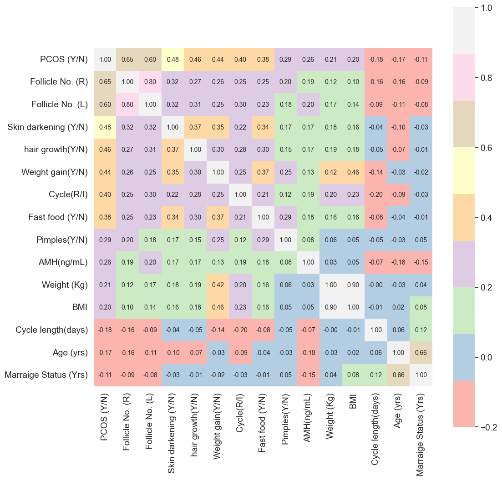

# PCOS_Diagnosis_ML
=======
# 🩺 Polycystic Ovary Syndrome (PCOS): Diagnosis & Analysis

## 📌 Project Overview
This project focuses on the **diagnosis and clinical analysis** of Polycystic Ovary Syndrome (PCOS), a prevalent hormonal and metabolic disorder affecting women of reproductive age. 

By leveraging **Machine Learning** and **Exploratory Data Analysis (EDA)**, the goal is to identify key physical and clinical markers that correlate with the syndrome and its associated infertility issues.

---

## 📊 Dataset Insights
The dataset provides a comprehensive look at clinical parameters, collected from **10 different hospitals** across Kerala, India. It serves as a robust basis for predictive modeling.

* 🔢 **Total Parameters:** 44 (Physical and Clinical)
* 👩‍⚕️ **Total Samples:** 541 patients
* 📍 **Source:** [Kaggle - PCOS Dataset](https://www.kaggle.com/prasoonkottarathil/polycystic-ovary-syndrome-pcos)

---

## 🛠 Data Specifics & Preprocessing
To ensure accurate analysis and model performance, the following data conventions were applied:

* 📏 **Height:** Recorded in **Centimeters (cm)**.
* 🩺 **Blood Pressure:** Captured as separate **Systolic** and **Diastolic** values.
* 🩸 **RBS:** Represents **Random Blood Sugar** test results.
* 🧪 **Beta-HCG:** Categorized into **Case I** and **Case II**.

### 🩸 Blood Group Mapping Reference
| Group | ID | Group | ID |
| :---: | :---: | :---: | :---: |
| **A+** | 11 | **O+** | 15 |
| **A-** | 12 | **O-** | 16 |
| **B+** | 13 | **AB+** | 17 |
| **B-** | 14 | **AB-** | 18 |

---

## 🚀 Key Analysis Features

---

